<h3><code>massimo@github ~ $ ./contributions.sh</code></h3>

  

<h3><code>massimo@github ~ $ whoami</code></h3>

<table>
<tr>
<td valign="top"></td>
<td valign="top"></td>
</tr>
</table>

  

<h3><code>massimo@github ~ $ ./connect.sh</code></h3>

<b>AI Developer · UX/UI Designer · Co-founder @ FAM Vision</b>

I design and build AI-powered products where engineering, automation and user experience meet.

 

Profile artwork is generated with Python and refreshed automatically by GitHub Actions.

